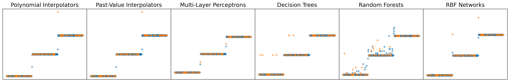

# Toolbox to model 1D time series from complex, dynamic industrial systems

<h1 align="center">

</h1><br>


## Contents

1. [Description](#Description)
2. [Download](#Download)
3. [Installation](#Installation)
4. [Modules Description](#Modules-Description)
5. [Example of Usage](#Example-of-Usage)


## Description
The **modeling** package is a toolbox that provides tools to model 1D time-series data. It features three main parts:

1. **Optimization**: functions and classes to compute the first and second order derivatives of a function, its gradient (with several variants, e.g. Backtracking and AdaGrad) and its Hessian matrix, as well as several optimization algorithms, among which the 1st order Gradient Descent, the 2nd order Newton method and the Levenberg-Marquardt simplification.
2. **Modeling**: classes to directly model time series, among which Polynomial and Sinusoidal Interpolations, Regressive Interpolation and the Radial Basis Function Networks (that may also be used as a multi-model).
3. **Multi-Modeling**: classes to model time series with a multi-model, i.e. a wide model which connects several much smaller models, each specialized in a dedicated part of the time series. Two multi-models are available: the regular Gating Networks, and a newly proposed one, based on trainable Gaussian membership functions that trigger the activation of the local models.

This work was the second part of the research I carried out as part of my doctoral studies, whose dissertation (thesis) is publicly available
[here](https://theses.hal.science/tel-05295895).
For extensive explanations on and comparison of the methods implemented in this toolbox, refer to *Chapter 3 Optimization & Modeling* and *Chapter 4 Modeling & Forecasting of Nonlinear, Dynamic Industrial Processes* of this dissertation, and for concrete examples of use in real industrial contexts, refer to *Chapter 5 Anomaly Detection and Classification in Industrial Contexts*.

The first part of the work investigated during my doctoral research deals with the clustering of ND data, and is made available as the
[`clustering`]()
package. Both projects have been made independent, but were originally conceived to work together: a dataset can first be clustered using tools from `clustering`, and then a multi-model can be built and trained on the so-issued clusters using the tools from `modeling`. Both packages can nonetheless be installed and used independently.

### Authors & Support
The project was developed at the Laboratoire Images, Signaux et Systèmes Intelligents (LISSI) of the University Paris-Est Créteil (UPEC), and is authored by:

- Dylan MOLINIE (main developer)
- Kurosh MADANI (ideas & reviews)

Contact Dylan MOLINIE (<dylan.molinie@gmx.fr>) for any query or support.

### Funding
This toolbox was part of the work developed for and delivered to the
[HyperCOG](https://www.hypercog.eu/)
project from the European Union's Horizon 2020 Research and Innovation Program (grant agreement No.869886); this project focused on the Industry 4.0's Cognitive Factory. 

### License
The project is distributed under GPLv3 license.


## Download

To download the project, either go to the project page:  
https://github.com/dmolinie/modeling

Or download it directly with the following command:

```bash
git clone https://github.com/dmolinie/modeling.git
```


## Installation
To install the `modeling` package, run the following command when in the package root folder:

```bash
pip install .
```

See the
[INSTALL.rst](INSTALL.rst)
file for further explanation on the requirements and options on installation.


## Modules Description
The different modules of the package are briefly described below. All the functions of every module with a short description for each of them are listed in the 
[MODULES.rst](MODULES.rst)
file.

* `interpolators`  
    Classes to model a time series: generic polynomial interpolator, past-based regression matrix model, past-based multi-model, that is a multi-model generalization (with a  strategy) of the latter.

* `multimodels`  
    Classes to build a multi-model on time series, that is a network that connects several smaller models, typically trained on specific parts of the feature space. Provides both a Gaussian membership Multi-Model and the more regular Gating Networks.

* `multimodels_win`  
    Simpler, windowed variant of the ``multimodels`` module: here, the data are assumed to be continuous (no data leap) and are interpolated using a sort of sliding window. These models are more restrictive and much more specific than those of ``multimodels``.

* `optimization`  
    Functions and classes to perform first and second order optimizations: Gradient Descent, Newton, Gauss-Newton & Levenberg-Marquardt methods, etc. Also provides estimation functions and the MSE cost function.

* `rbf_nets`  
    Class that implements Radial Basis Function (RBF) Networks, simple multi-models that use radial functions as local models. Also provides generic radial kernels for the RBF.


## Example of Use
Here is a an example of use of the main functionalities of the `modeling` package: it shows how to split a dataset into clusters (either manually or using the methods from the `clustering` package), build the regression matrices of the different so-issued clusters and how to train a multi-model (Gating Networks) to model these clusters.

More detailed examples are provided in the `scripts` folder of the package sources.

```python
import numpy as np

# Split the dataset into training & testing
from sklearn.model_selection import train_test_split

# Tools for optimizing & multimodeling
import modeling.optimization as opt
import modeling.multimodels as multi

# Local models from current implementation or from Scikit-Learn suit
from modeling.interpolators import Interpolator
from modeling.rbf_nets import RBFNet
from sklearn.tree import DecisionTreeRegressor


# Set the prediction parameters
COLS = [0, 1, 3]                            # Dimensions to model
DEPTH = 3                                   # Nb of previous data to use
STEP = 3                                    # Prediction step

# Set of models to use
METHODS = [
    [Interpolator,
     {'order': 2, 'interpolator': 'polynomial'},
     "Polynomial Interpolators"],
    [DecisionTreeRegressor,
     {'max_depth': 10},
     "Decision Trees"],
    [RBFNet,
     {'kernel': 'linear', 'centers': np.linspace(0, 1.5, 10, dtype=float)},
     "RBF Networks"]
]

# Generate a dummy database with 3 Gaussian distributions (regions)
rng = np.random.default_rng()
data = np.vstack(
    (rng.normal(loc=0.5, scale=0.01, size=(200, 5)),
     rng.normal(loc=5.0, scale=0.01, size=(200, 5)),
     rng.normal(loc=9.5, scale=0.01, size=(200, 5))))
# Generate a simple set of indexes
index = np.arange(len(data))

# Generate the training and testing sets of indexes
ind_trn, ind_gen = train_test_split(index, test_size=0.33, random_state=42)

#------------------------   Use direct Time Series   ------------------------#
# Below is an example using direct time-series data, as `np.ndarrays`.
# The out-of-bounds indexes (i.e. those ahead the prediction window) are
# removed from both training & testing indexes, and the list of training
# indexes (thus data) are stacked as distinct arrays to emulate a set of
# clusters to model and link within a multimodel.

# Remove the out-of-bounds indexes, if any
ind_trn = multi.check_oob_index(ind_trn, len(data), DEPTH, STEP)
ind_gen = multi.check_oob_index(ind_gen, len(data), DEPTH, STEP)

# Split the training indexes into several subsets to emulate several
# groups of data (clusters) obtained on the training data only
ind_trn_lst = [ind_trn[i*100:(i+1)*100] for i in range(4)]
#----------------------------------------------------------------------------#

#---------------------   Link to `clustering` Package   ---------------------#
# Below is an example with a true clustering method from the `clustering`
# package; the data & indexes are wrapped into a `Database` class container,
# which is then split using a clustering method (Kohonen's Self-Organizing
# Maps here). Then, the indexes of the training data from the different
# clusters are extracted, indexes that will be used to build the local
# regions matrices later on.

from clustering.formats import Database

# Wrap the data & indexes into a `Database` container
database = Database(data, index)

# Data partitioning
import clustering.cluster as clt

# Split the database into a training and a testing databases
dba_trn = database.select(ind_trn)          # Training dataset
dba_gen = database.select(ind_gen)          # Testing dataset

# Split the database
ksom_params = {
    'nb_clusters': 2, 'cluster': True, 'margins': 0.01, 'tmax': 100,
    'seed': None, 'verbose': True, 'distance': 'euclidean'}
clusters = clt.cluster(dba_trn, method='ksom', fuse=0., **ksom_params)

# Split the database into training and testing datasets
ind_trn_lst, ind_trn, ind_gen =\
    clt.rebuild_idx(database, clusters, len(database)-DEPTH-STEP)
#----------------------------------------------------------------------------#

#------------------------   Train the Multi-Models   ------------------------#
# Build the whole dataset's regression matrix and its set of objective values
inputs, outputs = multi.matreg(data, DEPTH, STEP, COLS) # or `database.value` if `Database`

# Build the regression matrices for the different dimensions of `COLS`
mat_inputs, mat_outputs = multi.local_matreg(inputs, outputs, ind_trn_lst)

# Build the sets of training & testing sets of inputs & outputs
# from the regression matrices
inp_trn, out_trn, inp_gen, out_gen =\
    multi.build_inps_outs(inputs, outputs, ind_trn, ind_gen)

# Train the local models
models = []
costs = np.empty((len(COLS), len(METHODS), 2), float)
for i, (matinp, matout, intrn, outrn, ingen, ougen) in enumerate(
    zip(mat_inputs, mat_outputs, inp_trn, out_trn, inp_gen, out_gen)):
    mods = []
    for j, method in enumerate(METHODS):
        # Train the Gating Networks
        model = multi.GatingNetworks(method[0], method[1])
        model.fit(matinp, matout)
        # Use the GN for prediction
        costs[i, j, 0] = opt.mse(model.predict(intrn), outrn)
        costs[i, j, 1] = opt.mse(model.predict(ingen), ougen)
        mods.append(model)
    models.append(mods)
print(costs)
#----------------------------------------------------------------------------#
```

